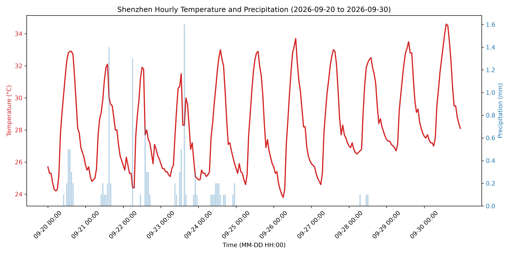

# Shenzhen Weather Visualization

## The phenomenon
This project visualizes the hourly temperature and precipitation trends in Shenzhen, China. Weather fluctuations directly impact daily commuting and outdoor activity planning in high-density urban environments.

## The source
The raw weather forecast data is obtained from the [Open-Meteo API](https://open-meteo.com/).
The dataset contains hourly intervals over 7 days. Each row represents a specific timestamp with corresponding 2m air temperature measured in degrees Celsius (°C) and precipitation measured in millimeters (mm).

## The picture


## What the picture shows
The visualization displays the continuous temperature curve in red alongside precipitation volume bars in blue across time. To improve clarity on the horizontal axis, precise minutes and second-level timestamps are discarded, displaying only reduced date-time labels at 12-hour steps.

## How to run it
```bash
uv run plot.py